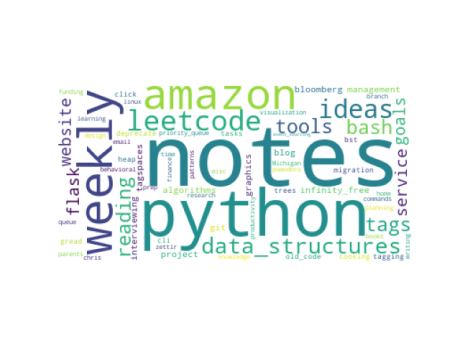

# Tags -> Wordcloud

## Goal

Collect all "tags" from a given directory and produce a wordcloud.

## Quickstart

```bash
$ python main.py /path/to/notes
```



## Tags

The "tags" here mean the [sidecar files](https://www.tagspaces.org/products/pro/#tagSidecarSaving) produced by [TagSpaces](https://www.tagspaces.org/).

A sidecar file is a JSON document that roughly looks like so:

```json
{
  "tags": [
    {
      "title": "notes",
      "color": "#61DD61",
      "textcolor": "white",
      "type": "sidecar"
    }
  ],
  "appName": "TagSpaces",
  "appVersionUpdated": "3.5.2",
  "lastUpdated": "2020-06-03T12:45:46.015Z"
}
```

## Assumptions

### "tag files" are all Markdown files

In `get_tag_files.py` the `GLOB` is set specifically for `.md.json` files. This means that it only looks at tags for Markdown files. This is exactly my use case and should be updated if you wish to use it for other cases.
